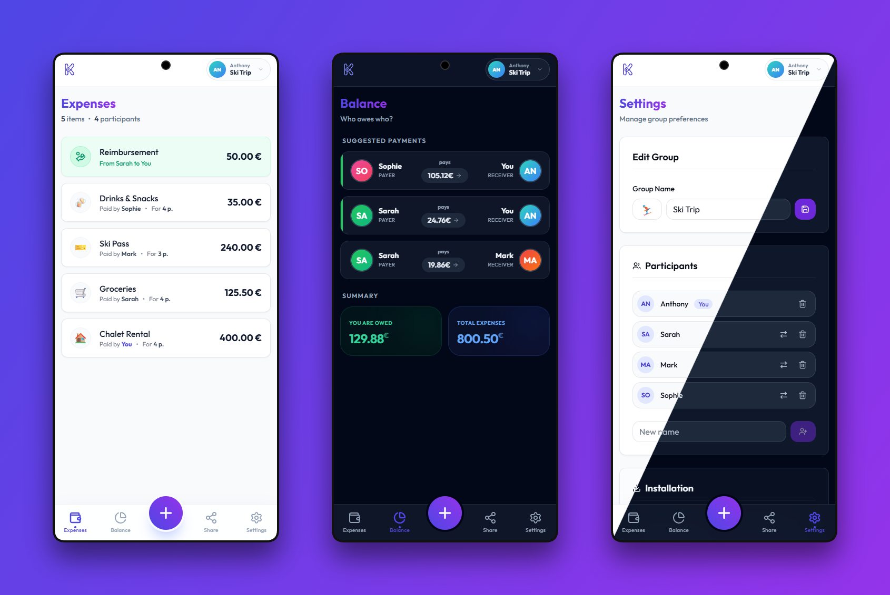

<div align="center">
  

  <h1>Kimpay</h1>

  <p>
    <strong>A modern, containerized expense-sharing web application.</strong>
    <br />
    <a href="https://kimpay.io"><strong>🌐 https://kimpay.io</strong></a>
  </p>

  <p>
    
    
    
    
  </p>
  
  <p>
    <a href="#features">Features</a> •
    <a href="#quick-start">Quick Start</a> •
    <a href="#tech-stack">Tech Stack</a>
  </p>
</div>

<br />

**Kimpay** is a modern, containerized expense-sharing web application (similar to Tricount/Splitwise) designed to be simple, fast, and delightful to use.



## <a id="features"></a>✨ Features

-   **No Login Required**: Start immediately—no account creation needed
-   **Cross-Platform**: Optimized for both mobile and desktop browsers
-   **Quick Setup**: Create a group in seconds with an emoji and a name
-   **Easy Sharing**: Invite friends via a short 6-character code or direct link
-   **Expense Management**: Add expenses specifying who paid and for whom
-   **Smart Balance**: Intelligent algorithm to minimize reimbursements ("Who owes whom")
-   **Real-Time**: Updates align instantly across devices
-   **Multilingual**: Available in English 🇬🇧 and French 🇫🇷
-   **Multi-Currency**: Support for 8 currencies (EUR, USD, GBP, JPY, AUD, CAD, CHF, CNH) with real-time exchange rates
-   **Dark Mode**: Elegant interface supporting both light and dark themes
-   **Delightful UX**: Smooth animations, emojis, and polished design
-   **PWA Ready**: Install as a Progressive Web App on any device

## <a id="tech-stack"></a>🛠️ Tech Stack

-   **Runtime**: **Node.js 24 (LTS)**
-   **Frontend**: [SvelteKit](https://kit.svelte.dev/) (SSR/CSR) + [TailwindCSS](https://tailwindcss.com/)
-   **Backend**: [PocketBase](https://pocketbase.io/) (Real-time SQLite database + Auth)
-   **Language**: TypeScript 5 (Strict Mode)
-   **Infrastructure**: Docker Compose (Production & CI environments)

## <a id="quick-start"></a>🚀 Quick Start

The entire project is containerized. You only need **Docker** installed.

### 1. Start the application (Production Mode)

```bash
make start
```

This builds and runs the application in production mode.

-   **Frontend**: [http://localhost:3000](http://localhost:3000)
-   **PocketBase Admin**: [http://localhost:8090/\_/](http://localhost:8090/_/)

### 2. Stop the application

```bash
make stop
```

## 🔧 Development Workflow

We provide a set of `make` commands to streamline development and ensure consistency across environments.

### 🏃‍♂️ Running in Development Mode

To start the app with hot-reloading (HMR):

```bash
make start-dev
```

### 🛡️ Code Quality & Testing

We use an **isolated CI container** to ensure linting and type-checking run in a consistent Node 24 environment, regardless of your local setup.

| Command         | Description                    |
| --------------- | ------------------------------ |
| `make check`    | Run Svelte check (Type Safety) |
| `make lint`     | Run ESLint (Code Style)        |
| `make lint-fix` | Auto-fix ESLint issues         |

### 🌍 Environment Variables

Configuration is handled via `docker-compose.yml`.

-   `PUBLIC_POCKETBASE_URL`: PocketBase API URL (default: `http://localhost:8090`)
-   `ORIGIN`: Application origin URL (default: `http://localhost:3000`)

## 📝 License

This project is open source and available under the MIT License.

---

_Made with ❤️ to simplify your group expenses._
