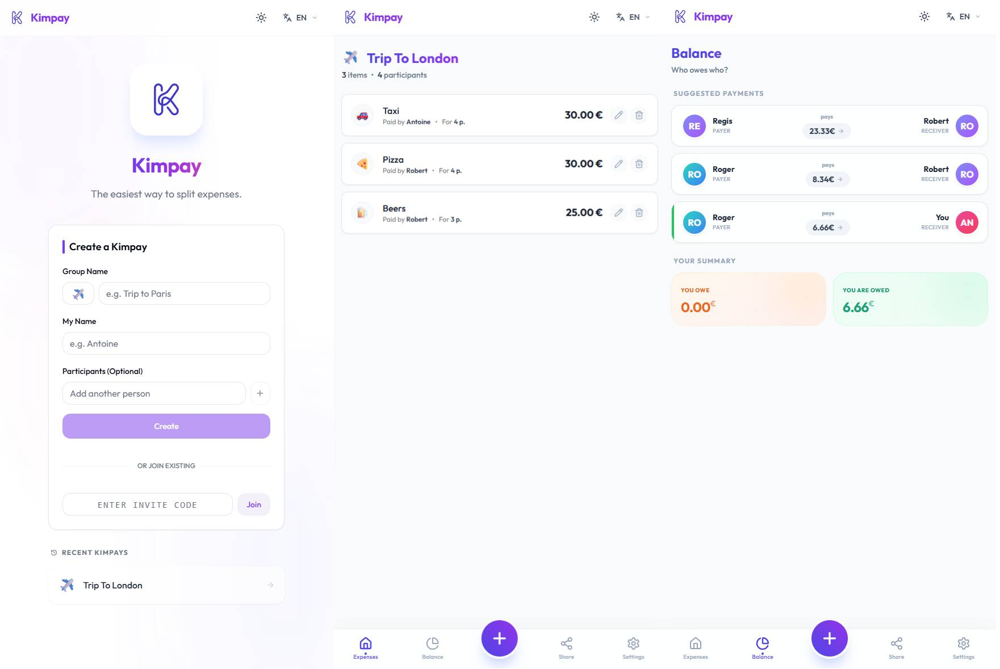

# ✈️ Kimpay

**Kimpay** is a modern expense-sharing web application (similar to Tricount/Splitwise) designed to be simple, fast, and delightful to use.



## ✨ Features

- **Quick Setup**: Create a group in seconds with an emoji and a name
- **Easy Sharing**: Invite friends via a short 6-character code or direct link
- **Expense Management**: Add expenses specifying who paid and for whom
- **Smart Balance**: Intelligent algorithm to minimize reimbursements ("Who owes whom")
- **Multilingual**: Available in French 🇫🇷 and English 🇬🇧
- **Dark Mode**: Elegant interface supporting both light and dark themes
- **Delightful UX**: Smooth animations, emojis, and polished design
- **PWA Ready**: Install as a Progressive Web App on any device

## 🛠️ Tech Stack

- **Frontend**: [SvelteKit](https://kit.svelte.dev/) (SSR/CSR) + [TailwindCSS](https://tailwindcss.com/)
- **Backend**: [PocketBase](https://pocketbase.io/) (Real-time SQLite database + Auth)
- **Deployment**: [Docker Compose](https://docs.docker.com/compose/)

## 🚀 Quick Start

The entire project is containerized. You only need Docker installed.

1. **Clone the repository**
   ```bash
   git clone <your-repo>
   cd kimpay
   ```

2. **Start the application**
   ```bash
   docker compose up -d --build
   ```

3. **Access the application**
   - Frontend: [http://localhost:3000](http://localhost:3000)
   - Backend (PocketBase Admin): [http://localhost:8090/_/](http://localhost:8090/_/)

## 🛡️ Accessibility & Quality

- **A11y**: Compliant with accessibility standards (keyboard navigation, ARIA roles)
- **Responsive**: Works perfectly on mobile, tablet, and desktop
- **Type-Safe**: Built with TypeScript for better developer experience

## 🔧 Development

### Local Development (without Docker)

1. **Start PocketBase**
   ```bash
   docker compose up -d pb
   ```

2. **Install dependencies and run dev server**
   ```bash
   cd app
   npm install
   npm run dev
   ```

### Environment Variables

- `PUBLIC_POCKETBASE_URL`: PocketBase API URL (default: `http://localhost:8090`)
- `ORIGIN`: Application origin URL (default: `http://localhost:3000`)

## 📝 License

This project is open source and available under the MIT License.

---

*Made with ❤️ to simplify your group expenses.*
